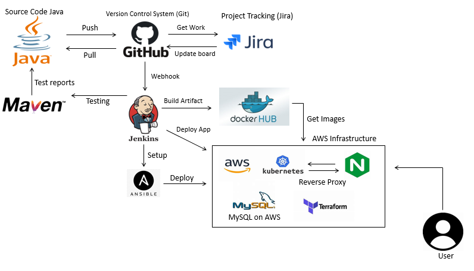

# Pet-clinic - Team SnowLeopord  
## Contents
* [Introduction](#introduction) 
  * [Objective](#objective)
  * [Requiremenents](#requirements)
  * [Proposal](#proposal)
* [Architecture](#architecture)
  * [Pipeline](#pipeline)
  * [Tools & Technology](#tools-&-technologies)
  * [Risk Assessment](#risk-assessment)
  * [Kanban Board](#kanban-board-&-project-tracking)
  * [Tools & Technologies](#tools-&-technologies)
* [Testing](#testing)
* [Application Deployment](#application-deployment)
  * [Prerequisites](#prerequisites)
  * [Installation](#installation)
  * [Deployment Process](#deployment-process)
  * [Refactoring](#refactoring)
  * [Monitoring](#monitoring)
* [Evaluation](#evaluation)
  * [Issues](#issues)
  * [Future Improvements](#future-improvements)
  

## Introduction

### Objective
The ultimate objective of this group project was to deploy a spring Pet-clinic application that utilizes AngularJS and a Java API. The project's purpose was to demonstrate our ability to use DevOps technologies and offer continuous integration and delivery even with unfamiliar applications and languages. Granted a broad level of autonomy and nature of the project we come up with our own solution and selected the tools we believe would work best, and demonstrate our approach.

### Requirements
- You will need to plan, design and implement a solution for automating the development workflows and deployments of this application. As part of your final deliverable you will need to discuss the project in a presentation and demonstrate these workflows.

- Carefully select the appropriate tools in order to deploy the application. There are no restrictions or requirements on which ones to use; you should decide which you feel are most appropriate and justify their use.

- Multiple Environment support: How can a developer test new features on an environment before merging their changes to the main branch?

- Configure something where changes on the GitHub repository automatically build and deploy to testing and live environments

- Running costs. What are your monthly estimates and can they be improved?

### Project Proposal
Our Approach to this project was to follow the MoSCow Agile methodology and fulfill the requirements based on priority level. By assigning roles specific to individuals' strengths within the team, the project was executed a lot more efficiently.

## Architecture

### Pipeline
Below is the image of our final CI/CD pipeline


The development section represents the workflow of the developers. As a developer pushes changes to the "dev" branch of the applications repository. it will trigger a development version of the pipeline which has its own unique variable IP address and other unique configurations which are specific to the dev branch set up. If the developer pushes changes to the "main" branch of said repo then a production pipeline will trigger instead, eventually deploying onto the production environment. However, this is only done once the final version (deployment ready) of the web application is ready.

This simple yet effective method is what allows developers to run dynamic tests on a development environment without the risk of affecting the production environment - this was one of the requirements of the project.

### Tools & Technologies
- Utilizing AWS CodePipeline with a webhook for the specific repisotory to facilitate continous integration and delivery via the use of an AWS EKS Cluster to run the app.
- Terraform - was used to provision the AWS resources; EC2 instance including manager nodes, an internet gateway (IGW), Security Groups (SG), Subnet, IAM, EKS and VPC.
used for infrastrcture as code deployment and infrastructure configuration.
- Kubernetes - used for cluster containerisation and running the application.
- Jenkins - used for continuous integration by utilizing webhooks to the VCS.
- Docker - Docker was used to create containers for both the frontend and the backend these images was then pushed up to a docker repository.
- MySQL - database to persist data entered on the website
- Ansible - used to provision the VMs with Docker and set up the master nodes as part of a swarm as well as build and operate the automation required for the project
- Cloudwatch - used for monitoring the project, i.e. cost and upscaling
- Github - used as a Version Control System, the repository was updated and maintained throughout the project. The use of feature branch models came particularly useful thoughout the projct for the purpsoe of efficeincy.


### Risk Assessment
Prior to beginning work on the project, we conducted an initial risk assessment. This enabled us to anticipate and address issues before they became a problem. The table below shows how probable each risk is to occur, as well as the impact it would have on the project if it does.


### Kanban Board & Project Tracking
For the Kanban board, we selected a Jira Board. This was used due to it's simplicity as well as it's ability to be personalised for each project.

We developed a Jira Board to track the project, which listed all of the tasks that needed to be completed. Wherever possible, an Agile methodology was used in accordance with the project brief. Daily scrums were held in addition to many sprints. Following our morning scrum, the group was split into smaller groups to execute certain tasks. The group will then call for another meeting at the end of the day to examine how the sub-groups did with their tasks and to coordinate workflow. 

Our Jira board followed the structure of:
- To do – Incomplete tasks and requirements.
- In progress – Tasks which are currently being worked on.
- Done – Completed tasks.

Below is an image of the Jira Board during mid-project.


Below is an image of the Jira Board towards the end of the project.

## Testing
The tests had all been written previously due to the project's nature. All we had to do as a team was made sure the testing software was installed and that all of the tests ran and passed. The testing software for this application was Maven. The script to run the tests is below:
````
#!/bin/bash
````
````
cd spring-petclinic-rest
````
````
sudo apt install maven
````
````
mvn test
````
## Application Deployment
### Prerequisites
- 1 AWS Virtual Machine instance (We used Ubuntu 18.04 LTS)
- IAM Setup for the correct permissions (administrator access) on initial startup 
- VM with port 8080 access for Jenkins
- Enable connection on DB using VM's IP Address

### Installation
- Install Jenkins on a VM 
- Add SUDO privileges for Jenkins by using:-
````
sudo visudo
````
- Inside the sudoers file add the following code:-
````
jenkins ALL=(ALL:ALL) NOPASSWD:ALL
````
- Check that this worked by changing to jenkins user and running sudo command:
````
sudo su - jenkins
````
````
sudo echo "Hello I'm jenkins using sudo!"
````
````
exit
````

- Configure the pipeline on Jenkins by opening port 8080 and selecting the right branch to initiate the automation.
- Set the Environment Variables by storing them in Global Credentials section
- Configure a Webhook using:
````
(http://VM-IPaddress:8080/github-webhook/)
Content Type: application/json
````

### Deployment Process
When something is pushed to the GitHub repo once the Webhook is configured, the deployment procedure begins. The pipeline should construct the application successfully if all steps have been followed appropriately. Because this is a totally automated procedure, the application may be created with the click of a single button (via a WebHook or physically starting the build in Jenkins).
The application is up and running once the build is complete and all elements have been created. You can explore the Spring Pet Clinic by accessing the application through the Load Balancer's IP address.

### Refactoring
One particular change we made during the final sprint/timebox was during the technical dedeployment phase application. After attempting to configure using Terraform and Ansible. It was decided by the Product Owner that it is more efficient to deploy the application through Kubernetes so that we could focus on the MVP requirements and not miss the deadline. This made is more realistic and industry specific as developers would be required to follow sprints & timeboxes within the real world.

### Kubernetes and Jenkins
- Kubernetes was a good fit as the container orchestration tool because the application required a more complicated configuration for the frontend and backend to communicate with each other. We configured the deployments and services required for the application to be successfully accessible by an end user using configuration files. The backend, frontend, and Nginx server all have configuration files that allow the first two components to communicate with one another.

- Jenkins The preceding operations were automated using Jenkins. When a commit was made to the repository, a Webhook was utilised to start the process. The scripts to run were defined in a Jenkinsfile. There were four scripts in total: The deployment pipeline required to go through four stages in total. The Declarative Checkout SCM is the first. This section effectively checks and structures the way through which the pipeline will be constructed. The configuring of the environment was the second stage. This stage was used to get access to the installation.sh and downloaded the environment needed to start the application deployment.


- The third stage was deploying the application, which involved downloading the images from DockerHub and then deploying the entire application using Nginx as the reverse proxy. The testing environment, or the test built to examine the application's back-end, was the last stage. Jenkins was used to automate the testing.

### Monitoring
In order to successfully monitor the varied resources that were utilized during the project, a CloudWatch events was set up to monitor our project and identify any potential issues. This included
We were able to track the PetClinic's resources by constructing a unique dashboard. We created a dashboard that shows the most up-to-date statistic at the time of access. For example: 
- Network Traffic Rates - Higher than usual traffic may mean a malicious attack.
- High CPU usage - Would automatically spin up a new VM instance in order to successfully reduce the strain place don other VM's.
- A trigger to notify us when the cost was closely approaching the monthly budget.


Initially, We had a £30 budget for our project. Initially, we attempted to stay under AWS's free tier consumption to be as efficient as possible. The application, however, required more memory and CPU than the free tier instances could provide. In this instance, our usual approach to costing would be to run the infrastructure for a set length of time to gather data on utilisation as this would be the most economical of Amazon's packages. Based on this, we'd use cloud resources' scalability to scale our infrastructure in response to demand. For instance, we'd be able to grow based on seasonal need (for example, during the Christmas season) and daily demand (example, a certain period of the day is consistently more busy).

## Evaluation
### Issues
- One particular issue which we faced was that we found the deployment of the application was very static and specific to one individual. This unfortunately meant that if somebody decided to clone the application from github and run it themselves it would not work due to serveral components. For example, the AWS instances have been configured on that individual's AWS, futhermore, the credentials such as the secret access key etc would be unique to that individual. This unfortunately meant when diagnosing an issue, that individual had to share their screen which could be very time consuming.
- Database unable to connect

### Future Improvements
Although the application could be drastically improven in many regards, it was the deployment of the applciation itself which we were tasked with executing.
In terms of the deployment itself these ar ethe following future improvements which we would implement
- Integration testing, this would done through the use of Selenium to ensure that every aspect of the application is accounted for and that there are no faults within the application itself.
- Removing sudo priveleges from Jenkins, removing sudo privelages from Jenkins would create a more secure and safe application. If a user maliciously gains access to the Jenkins port, it could result in a disaster. This could have been resolved by encrypting secret keys using the encryption tool provided by Jenkins
- Authentication, creating a system which ensures that the user attempting to access the backend/front-end and any other tools is an authorized user would reduce the risks associated with the project. This would prevent unauthorized individuals from accessing the project. It's not efficient or practical to have a database which is accessible by anyone, therefore, having a login as a requirmeent in order to access this data would add another layer of security.
- Enhanced Monitoring, enhancing monitoring by implementing a system that would allow a CloudWatch event to trigger a lambda function which can manage the EC2 instances. This would ensure that old ones instances are immediately turned after a new instance is built through the pipeline. This would ultimately reduce costs as well as the fact that more complex CloudWatch monitoring would give  access to the instances RAM usage, which we found to be too small when running the applications on multiple occassions. 
- In addition, implementing XRAY would also a useful feature that would've given us information on how our application was responding to incoming HTTP requests.
